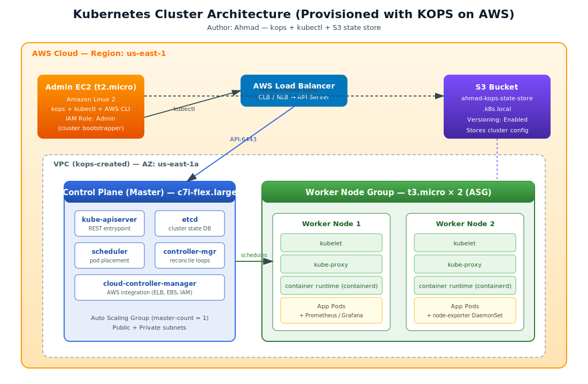
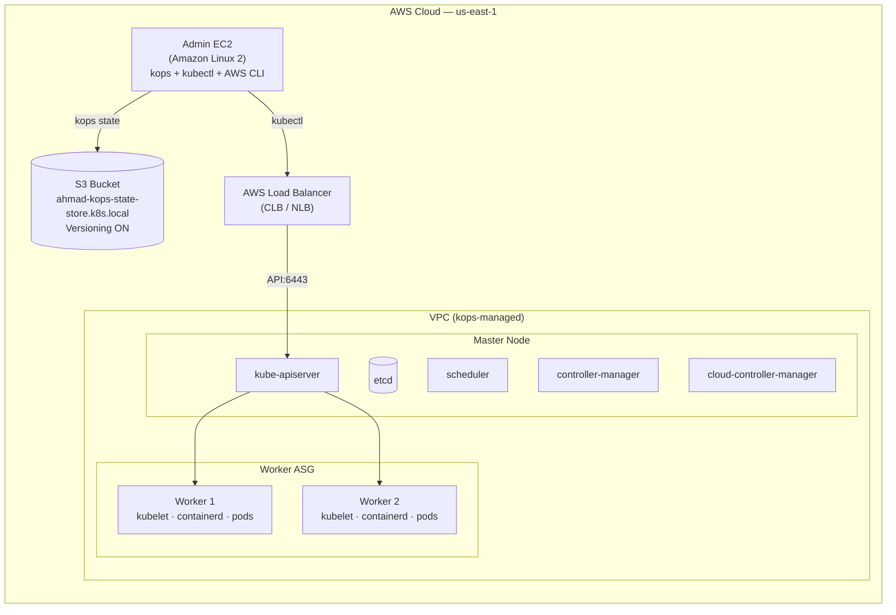
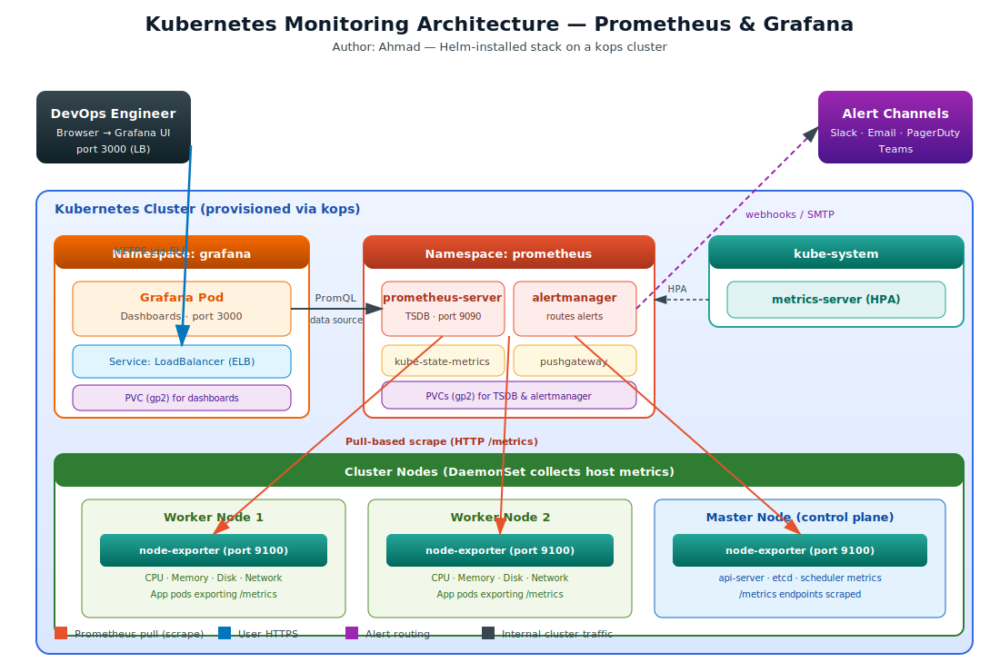
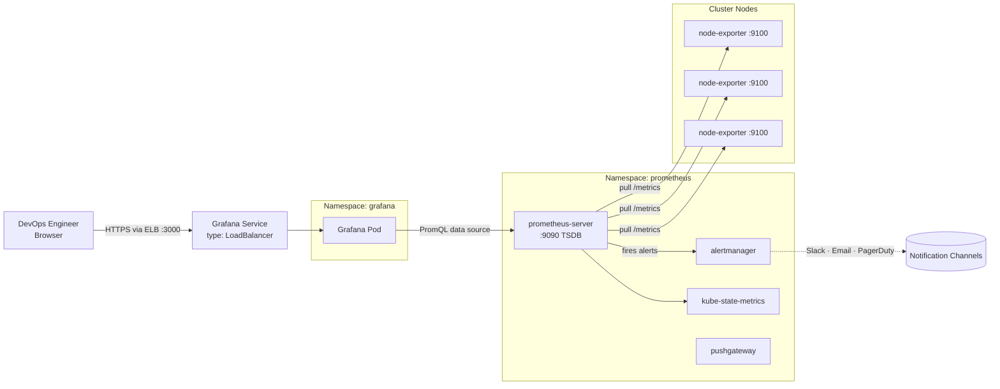

# Production-Grade Kubernetes on AWS with KOPS — Monitored by Prometheus & Grafana

> An end-to-end walkthrough that spins up a real Kubernetes cluster on AWS using **kops**, then layers a full observability stack (**Prometheus + Grafana + Node Exporter**) on top of it using **Helm**.

**Author:** Ahmad

---

## Table of Contents

1. [Why This Project](#why-this-project)
2. [Architecture](#architecture)
   - [Kubernetes Cluster Architecture](#kubernetes-cluster-architecture)
   - [Monitoring Stack Architecture](#monitoring-stack-architecture)
3. [Tooling Glossary](#tooling-glossary)
4. [Prerequisites](#prerequisites)
5. [Phase 1 — Provision the KOPS Cluster](#phase-1--provision-the-kops-cluster)
6. [Phase 2 — Install Helm & Metrics Server](#phase-2--install-helm--metrics-server)
7. [Phase 3 — Install Prometheus](#phase-3--install-prometheus)
8. [Phase 4 — Install Grafana](#phase-4--install-grafana)
9. [Phase 5 — Wire Prometheus into Grafana](#phase-5--wire-prometheus-into-grafana)
10. [Phase 6 — Import Ready-Made Dashboards](#phase-6--import-ready-made-dashboards)
11. [Phase 7 — Node Exporter (Host-Level Metrics)](#phase-7--node-exporter-host-level-metrics)
12. [Cluster Lifecycle Operations](#cluster-lifecycle-operations)
13. [Tearing Everything Down](#tearing-everything-down)
14. [Troubleshooting Notes](#troubleshooting-notes)
15. [Credits](#credits)

---

## Why This Project

Running Kubernetes is the easy part — *understanding* what your cluster is doing is the hard part. This repo captures the exact workflow I follow to:

- Stand up a multi-node Kubernetes cluster on AWS in a repeatable way using **kops** (no managed control plane, no hand-holding from EKS).
- Persist every cluster mutation in **S3** so the cluster state can be re-hydrated even if my admin box dies.
- Bolt on a **Prometheus + Grafana** stack via Helm so I can see CPU, memory, pod, node, PV/PVC, and API-server health at a glance.
- Pull host-level metrics out of every node with **Node Exporter** to fill in the gaps that kube-state-metrics does not cover.

If you just want a learning project that mirrors what production Kubernetes teams actually do, this is it.

---

## Architecture

### Kubernetes Cluster Architecture

The diagram below summarises the AWS footprint that kops builds for us — a dedicated admin EC2 box, the S3 bucket holding cluster state, the load balancer fronting the API server, the master node hosting the control-plane components, and the auto-scaled worker pool running our workloads.



A high-level Mermaid view of the same idea (renders directly on GitHub):



### Monitoring Stack Architecture

The monitoring layer lives **inside** the cluster as Helm releases. Prometheus scrapes metrics from node-exporters, kube-state-metrics, and any pod that exposes a `/metrics` endpoint, while Grafana sits in front as the visualisation layer (and reaches Prometheus over the in-cluster service DNS).



Mermaid version:



---

## Tooling Glossary

This section paraphrases the moving parts so the rest of the README makes sense — feel free to skip if you already know the stack.

**Observability** is the umbrella term for being able to *ask any question* about your running system without having to ship new code. In practice it boils down to three pillars: **monitoring** (numerical metrics over time), **logs** (timestamped events), and **alerts** (automatic pages when something looks off). A good DevOps setup gives you all three.

**Prometheus** is the de-facto open-source monitoring system for cloud-native workloads. It uses a *pull* model — Prometheus reaches out to your services on a schedule, scrapes their `/metrics` endpoint, compresses the values, and writes them into its own time-series database. Its query language **PromQL** lets you slice that data any way you want, and its companion **Alertmanager** routes alerts to Slack, email, PagerDuty, Teams, and so on. Default port: **9090**.

**Grafana** is a visualisation and dashboarding tool. It does not store data of its own — instead, it talks to *data sources* (Prometheus, Loki, CloudWatch, MySQL, Google Sheets, even a CSV file) and renders them as panels, graphs and tables that anyone in the org can read. Default port: **3000**, default credentials `admin / admin` on a fresh install (we override this below).

**Grafana Loki** is the log-aggregation cousin of Prometheus. Instead of indexing the *contents* of every log line, Loki indexes only a small set of *labels*, which keeps it cheap and easy to operate. Conceptually: Prometheus is to metrics what Loki is to logs.

**Promtail** is the agent that ships logs from a node into Loki. Loki then exposes them as a Grafana data source.

**KOPS (Kubernetes Operations)** provisions a real Kubernetes cluster on AWS — VPC, subnets, IAM, ASGs, ELB, EBS volumes — from a single command. It stores the desired state of the cluster in an S3 bucket so the cluster can be repaired or rebuilt later.

**Helm** is the package manager for Kubernetes. The same way `yum` works on RedHat or `apt` on Ubuntu, Helm installs *charts* (a bundle of Kubernetes manifests) into a cluster. A running, configured instance of a chart is called a **release**. We use Helm here because the official Prometheus and Grafana charts are well-maintained and save us from writing dozens of YAML files by hand.

**Other monitoring tools you'll hear about**: Nagios, Zabbix, Splunk, ELK / Kibana, New Relic, Datadog. Each fits a slightly different niche; for a Kubernetes cluster, Prometheus + Grafana is hard to beat on cost and ecosystem.

---

## Prerequisites

Before you start, make sure you have:

- An AWS account (free tier is fine for this lab).
- A domain or the willingness to use a `*.k8s.local` gossip-based cluster name (used here).
- An EC2 key pair, or be ready to let kops generate one.
- An IAM user/role with **AdministratorAccess** for the bootstrap process (you can lock this down later).
- A locally installed **AWS CLI v2** if you plan to run commands from your laptop — otherwise we will install it on the admin EC2 below.

---

## Phase 1 — Provision the KOPS Cluster

### 1.1 Launch the Admin EC2

Spin up an **Amazon Linux 2** EC2 instance, type **t2.micro**, and **attach an IAM Role with administrative permissions**. This box is the launchpad — kops, kubectl, and the AWS CLI will run from here, and from here we will reach the cluster after it boots.

Confirm the AWS CLI is available:

```bash
aws --version
```

### 1.2 Install `kubectl` and `kops`

Run the following on the admin EC2:

```bash
# Pull a kubectl that matches the cluster Kubernetes version
# (kops v1.25.0 provisions Kubernetes 1.25.x by default — keep kubectl within ±1 minor)
curl -LO "https://dl.k8s.io/release/v1.25.16/bin/linux/amd64/kubectl"

# Pull a known-good kops release
wget https://github.com/kubernetes/kops/releases/download/v1.25.0/kops-linux-amd64

# Make both binaries executable and move them onto the system PATH
chmod +x kops-linux-amd64 kubectl
sudo mv kubectl /usr/local/bin/kubectl
sudo mv kops-linux-amd64 /usr/local/bin/kops
```

> If you bump kops to a newer minor version, also bump the kubectl pin to match — kubectl is officially supported within one minor version of the cluster.

### 1.3 Make `/usr/local/bin` Permanent on the PATH (Amazon Linux only)

On Amazon Linux 2 the binaries we just dropped into `/usr/local/bin` are not on the default `PATH`, so we extend it:

```bash
vi ~/.bashrc
```

Append this line at the bottom of the file:

```bash
export PATH=$PATH:/usr/local/bin/
```

Save and quit (`:wq`), then reload:

```bash
source ~/.bashrc
```

> On Ubuntu this step is unnecessary — `/usr/local/bin` is already on the PATH.

Sanity-check both binaries are now reachable:

```bash
kubectl version --client
kops version
```

### 1.4 Create the S3 State Store

Kops writes every aspect of the cluster's desired state into an S3 bucket. **If your admin EC2 dies, this bucket is what lets you recover the cluster.** Versioning is enabled so we have a history of every change.

You can create the bucket from the AWS console, or run:

```bash
# Create the bucket (must be globally unique — change the name)
aws s3api create-bucket \
  --bucket ahmad-kops-state-store.k8s.local \
  --region us-east-1 \
  --create-bucket-configuration LocationConstraint=us-east-1
```

> Heads up: for `us-east-1` AWS does **not** require `--create-bucket-configuration`, but leaving it in does no harm in other regions. Adjust to your region.

```bash
# Enable versioning so cluster state is recoverable
aws s3api put-bucket-versioning \
  --bucket ahmad-kops-state-store.k8s.local \
  --region us-east-1 \
  --versioning-configuration Status=Enabled
```

Tell kops where the bucket lives:

```bash
export KOPS_STATE_STORE=s3://ahmad-kops-state-store.k8s.local
```

> Add the `export` line to `~/.bashrc` too so it survives a reboot.

### 1.5 Generate the Cluster Definition

This describes the cluster we want — 1 master, 2 workers, all in one AZ. The `*.k8s.local` suffix puts kops into "gossip" mode so we don't need to own a Route 53 domain.

```bash
kops create cluster \
  --name ahmad.k8s.local \
  --zones us-east-1a \
  --master-count=1 \
  --master-size c7i-flex.large \
  --node-count=2 \
  --node-size t3.micro
```

### 1.6 Apply the Cluster

`create cluster` only writes the definition to S3 — `update cluster --yes` actually provisions AWS resources.

```bash
kops update cluster \
  --name ahmad.k8s.local \
  --yes \
  --admin
```

What each flag does:

- `kops update cluster` — reconciles the cluster definition with what is live on AWS.
- `--name ahmad.k8s.local` — which cluster to update.
- `--yes` — apply changes without an interactive prompt.
- `--admin` — generate and configure an admin kubeconfig entry for the current user so `kubectl` works immediately.

### 1.7 Wait for the Cluster to be Healthy

```bash
kops validate cluster --wait 10m
```

This blocks until every node and control-plane component reports `Ready`, polling for up to 10 minutes. When it returns successfully, you have a Kubernetes cluster.

Confirm with kubectl:

```bash
kubectl get nodes
kubectl get pods -A
```

In the AWS console you will now see EC2 instances inside an Auto Scaling Group with an attached load balancer. By default kops creates a **Classic Load Balancer (CLB)** in front of the API server. To switch to a **Network Load Balancer (NLB)**:

```bash
kops edit cluster --name ahmad.k8s.local
```

Inside the editor, change the value of `spec.api.loadBalancer.class` from `Classic` to `Network`. Save and quit, then apply:

```bash
kops update cluster --name ahmad.k8s.local --yes --admin
kops rolling-update cluster --name ahmad.k8s.local --yes
```

### 1.8 Useful Day-2 Commands

```bash
kops get cluster
kops edit cluster ahmad.k8s.local
kops edit ig --name=ahmad.k8s.local nodes-us-east-1a
kops edit ig --name=ahmad.k8s.local master-us-east-1a
```

### 1.9 Optional: Bootstrap via Script

If you want a one-shot install on the admin box, drop the following into `kops.sh` and run it:

```bash
vi kops.sh
```

```bash
#!/bin/bash
# kops.sh — one-shot KOPS bootstrap for Amazon Linux 2

aws configure

curl -LO "https://dl.k8s.io/release/v1.25.16/bin/linux/amd64/kubectl"
wget https://github.com/kubernetes/kops/releases/download/v1.25.0/kops-linux-amd64
chmod +x kops-linux-amd64 kubectl
sudo mv kubectl /usr/local/bin/kubectl
sudo mv kops-linux-amd64 /usr/local/bin/kops

aws s3api create-bucket --bucket ahmad-kops-state-store.k8s.local --region us-east-1 --create-bucket-configuration LocationConstraint=us-east-1
aws s3api put-bucket-versioning --bucket ahmad-kops-state-store.k8s.local --region us-east-1 --versioning-configuration Status=Enabled
export KOPS_STATE_STORE=s3://ahmad-kops-state-store.k8s.local

kops create cluster --name ahmad.k8s.local --zones us-east-1a --master-count=1 --master-size c7i-flex.large --node-count=2 --node-size t3.micro
kops update cluster --name ahmad.k8s.local --yes --admin
```

Then:

```bash
chmod +x kops.sh
./kops.sh
```

Once the script finishes, run:

```bash
export KOPS_STATE_STORE=s3://ahmad-kops-state-store.k8s.local
kops validate cluster --wait 10m
kops update cluster --name ahmad.k8s.local --yes --admin
kops rolling-update cluster
```

---

## Phase 2 — Install Helm & Metrics Server

### 2.1 Install Helm 3

Helm is what we'll use to install Prometheus and Grafana. It works the way `yum` works on RedHat or `apt` works on Ubuntu — except instead of `.rpm` or `.deb` files, the unit of install is a **chart** (a bundle of templated Kubernetes manifests). A chart that has been deployed with a particular set of values is called a **release**.

```bash
curl -fsSL -o get_helm.sh https://raw.githubusercontent.com/helm/helm/main/scripts/get-helm-3
chmod 700 get_helm.sh
./get_helm.sh
helm version
```

### 2.2 Install the Kubernetes Metrics Server

Metrics Server is what powers `kubectl top` and the Horizontal Pod Autoscaler. It is independent of Prometheus but useful to have running.

```bash
kubectl apply -f https://github.com/kubernetes-sigs/metrics-server/releases/latest/download/high-availability-1.21+.yaml
```

Verify:

```bash
kubectl get deploy -n kube-system metrics-server
kubectl top nodes
```

---

## Phase 3 — Install Prometheus

### 3.1 Add the Helm Repositories

```bash
helm repo add prometheus-community https://prometheus-community.github.io/helm-charts
helm repo add grafana https://grafana.github.io/helm-charts
```

### 3.2 Refresh the Helm Index

```bash
helm repo update
helm repo list
```

### 3.3 Create a Dedicated Namespace

We isolate Prometheus in its own namespace so its RBAC and PVCs are easy to manage.

```bash
kubectl get ns
kubectl create namespace prometheus
kubectl get ns
```

### 3.4 Install Prometheus

We tell Helm to back Prometheus' TSDB and Alertmanager with `gp2` EBS volumes — this way metrics survive pod restarts.

```bash
helm install prometheus prometheus-community/prometheus \
  --namespace prometheus \
  --set alertmanager.persistentVolume.storageClass="gp2" \
  --set server.persistentVolume.storageClass="gp2"
```

Verify the pods come up:

```bash
kubectl get pods -n prometheus
kubectl get all -n prometheus
```

You should see `prometheus-server`, `alertmanager`, `kube-state-metrics`, `pushgateway`, and the chart's own `node-exporter` DaemonSet.

---

## Phase 4 — Install Grafana

### 4.1 Create the Grafana Namespace

```bash
kubectl create namespace grafana
```

### 4.2 Install Grafana

We expose Grafana via an ELB so we can hit it from a browser, set the admin password up front, and back the dashboards with persistent storage.

```bash
helm install grafana grafana/grafana \
  --namespace grafana \
  --set persistence.storageClassName="gp2" \
  --set persistence.enabled=true \
  --set adminPassword='Root123456' \
  --set service.type=LoadBalancer
```

Check the rollout and grab the external URL:

```bash
kubectl get pods -n grafana
kubectl get service -n grafana
```

The `EXTERNAL-IP` column for an AWS LoadBalancer service contains a **DNS hostname** (something like `aXXXX.us-east-1.elb.amazonaws.com`), not a literal IP. Copy that DNS name into your browser.

- **Username:** `admin`
- **Password:** `Root123456`

> If the page does not load, check three things: (1) the worker-node security group allows inbound traffic on the **NodePort range (30000-32767)** from the ELB security group — kube-proxy publishes the Grafana service on a NodePort that the CLB targets, (2) the ELB health checks on the AWS console show targets as `InService`, and (3) you are using the ELB **DNS name**, not a worker EC2 IP.

---

## Phase 5 — Wire Prometheus into Grafana

In the Grafana UI:

1. Go to **Configuration → Data Sources → Add data source**.
2. Pick **Prometheus**.
3. For **URL**, enter the in-cluster service DNS — this is the *same* in every kops-built cluster:

   ```
   http://prometheus-server.prometheus.svc.cluster.local/
   ```

4. Scroll to the bottom and click **Save & Test**. You should see *"Data source is working"*.

---

## Phase 6 — Import Ready-Made Dashboards

The Grafana community publishes thousands of pre-built dashboards at <https://grafana.com/grafana/dashboards/>. Each one has a numeric ID — you import by ID instead of pasting JSON.

In Grafana: **Dashboards → New → Import → enter the ID → Load → choose the Prometheus data source → Import**.

Recommended dashboards to import:

| Dashboard ID | Purpose |
|--------------|---------|
| **6417** | Kubernetes cluster monitoring (high-level) |
| **315**  | Kubernetes cluster monitoring (alternative view) |
| **1860** | Node Exporter Full — per-node CPU / memory / disk / network |
| **11454**| Persistent Volumes & PVCs |
| **747**  | Kubernetes pod metrics |
| **14623**| Kubernetes overview *(my favourite — start here)* |
| **10907**| Kubernetes API Server health |

> If a dashboard panels show "No data", double-check the data-source dropdown at the top of the dashboard is pointed at your Prometheus.

---

## Phase 7 — Node Exporter (Host-Level Metrics)

`node-exporter` is the agent that exposes host-level statistics (CPU, memory, disk, network, filesystem, load average) over an HTTP `/metrics` endpoint. The Prometheus Helm chart already ships a `node-exporter` DaemonSet inside the cluster — but you may also want it on machines *outside* the cluster (a VPN box, a CI runner, or a standalone EC2). The script below installs Node Exporter as a `systemd` service on any Linux host.

Save as `nodeexp.sh`:

```bash
vi nodeexp.sh
```

```bash
#!/bin/bash
# nodeexp.sh — install node-exporter as a systemd service

wget https://github.com/prometheus/node_exporter/releases/download/v1.5.0/node_exporter-1.5.0.linux-amd64.tar.gz
tar -xf node_exporter-1.5.0.linux-amd64.tar.gz
sudo mv node_exporter-1.5.0.linux-amd64/node_exporter /usr/local/bin
rm -rv node_exporter-1.5.0.linux-amd64*

sudo useradd -rs /bin/false node_exporter

sudo cat <<EOF | sudo tee /etc/systemd/system/node_exporter.service
[Unit]
Description=Node Exporter
After=network.target

[Service]
User=node_exporter
Group=node_exporter
Type=simple
ExecStart=/usr/local/bin/node_exporter

[Install]
WantedBy=multi-user.target
EOF

sudo cat /etc/systemd/system/node_exporter.service
sudo systemctl daemon-reload && sudo systemctl enable node_exporter
sudo systemctl start node_exporter.service && sudo systemctl status node_exporter.service --no-pager
```

Run it:

```bash
sh nodeexp.sh
```

Verify it is listening:

```
http://<host-ip>:9100
```

You should see a plain-text page of metrics. Add a scrape job to Prometheus pointing at `http://<host-ip>:9100/metrics` to start collecting them.

> Useful service commands on the host: `sudo systemctl status node_exporter`, `sudo systemctl restart node_exporter`, and `sudo journalctl -u node_exporter -f` to tail the logs.

---

## Cluster Lifecycle Operations

```bash
# Inspect the cluster
kops get cluster
kops validate cluster

# Mutate cluster definition
kops edit cluster --name ahmad.k8s.local

# Apply changes you have made
kops update cluster --name ahmad.k8s.local --yes --admin

# Roll the new config out to running nodes (replaces instances one-at-a-time)
kops rolling-update cluster --name ahmad.k8s.local --yes
```

---

## Tearing Everything Down

When you are done, **always** delete the cluster — otherwise the EC2 instances, EBS volumes, NAT gateways, and ELB will keep billing you.

```bash
kops delete cluster --name ahmad.k8s.local --yes
```

If you also want to wipe the state store:

```bash
aws s3 rb s3://ahmad-kops-state-store.k8s.local --force
```

---

## Troubleshooting Notes

- **`kops validate cluster` times out** — usually a missing IAM permission on the admin role, or the EC2 instances are still pulling images. Check `kubectl get nodes` and `kubectl describe node <name>`.
- **`helm install` errors with `cannot re-use a name`** — a previous release already exists. Run `helm list -A` and `helm uninstall <name> -n <ns>`.
- **Grafana ELB does not get an external hostname** — kops uses the in-tree AWS cloud provider (via `cloud-controller-manager`) to provision a CLB for `type: LoadBalancer` services, not the AWS Load Balancer Controller. The usual culprits are: missing IAM permissions on the master node role, public subnets that are not tagged with `kubernetes.io/role/elb=1`, or worker security groups that block ingress from the CLB. Check `kubectl describe svc grafana -n grafana` and the cloud-controller-manager logs on the master.
- **Prometheus pods stuck `Pending`** — almost always a PVC binding issue. Confirm the `gp2` storage class exists with `kubectl get sc`.
- **Dashboard panels show "No data"** — verify the Grafana data source URL is `http://prometheus-server.prometheus.svc.cluster.local/` and the data source dropdown on the dashboard is pointing at it.

---

## Credits

Authored and maintained by **Ahmad**.

Pull requests, issues, and improvements are welcome.
